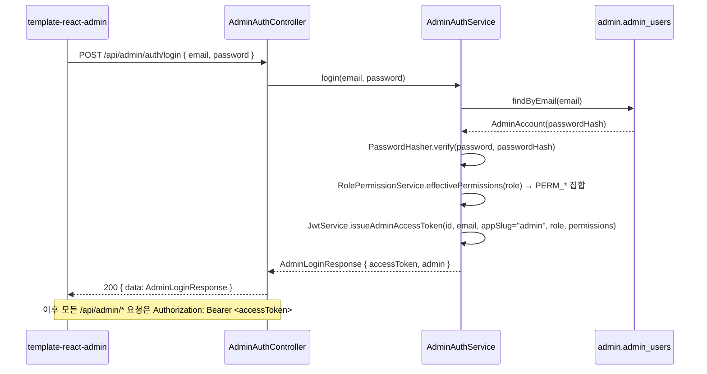

# 운영 콘솔 API — admin-console

> **유형**: Explanation · **독자**: Level 2 · **읽는 시간**: ~15분

**설계 근거**: [`ADR-039 (admin 모듈 — superadmin + admin 스키마 + in-process fan-out)`](../philosophy/adr-039-admin-module.md) · [`ADR-005 (단일 Postgres + 앱당 schema)`](../philosophy/adr-005-db-schema-isolation.md) · [`ADR-012 (앱별 독립 유저 모델)`](../philosophy/adr-012-per-app-user-model.md) · [`ADR-018 (SchemaRoutingDataSource)`](../philosophy/adr-018-schema-routing-datasource.md) · [`ADR-037 (core schema 폐기)`](../philosophy/adr-037-core-schema-deprecation.md) · [`ADR-027 (admin role 권한 분리)`](../philosophy/adr-027-admin-role-authorization.md)

이 문서는 `template-react-admin`(React 운영 콘솔)이 소비하는 `/api/admin/*` 백엔드 계약을 정리합니다. 솔로 운영자가 자기가 만든 여러 앱(슬러그)의 유저·매출·실패율·활동 지표를 **한 번 로그인으로 전부** 보기 위한 cross-app 콘솔이에요. 앱 사용자가 쓰는 `/api/apps/{slug}/*` 와는 완전히 분리된 인증·권한 체계를 씁니다.

---

## 한 문장 요약

운영 콘솔은 `admin` schema 계정으로 로그인해 RBAC 4티어(viewer/support/admin/master)의 효과 권한(`PERM_*`)이 `permissions` claim 으로 실린 콘솔 JWT 를 받고, `/api/admin/*` 에서 모든 앱 schema 를 in-process fan-out 으로 조회·운영하는 cross-app API 예요.

---

## 1. 개요

`core-admin-impl` 모듈이 이 API 를 제공합니다. 앱 데이터를 저장하는 곳은 아니고, 이미 존재하는 앱별 schema 를 **fan-out** 으로 읽기만 하는 조회 중심 콘솔이에요. 운영자 계정과 역할·권한만 담는 `admin` schema 가 유일한 예외적인 신규 저장소입니다 — `V001` 이 `admin_users` 를 만들고, `V002` 가 RBAC 역할 컬럼(`role`, 기본 `master`)을, `V003` 이 역할별 권한 grant 표(`role_permissions`)를 추가해요.

```text
[React admin] ──(콘솔 JWT: role + permissions)──> /api/admin/*  ──> core-admin-impl (bootstrap jar 안)
                                                                      │
                                                                      ├─ admin 스키마: admin_users (V002 role) + role_permissions (V003)
                                                                      └─ 앱 스키마 fan-out: 슬러그 순회 조회 → 메모리 합산/병합
```

- **cross-app 조회 = in-process fan-out** — MSA 라면 필요했을 서비스 간 호출·분산 트랜잭션이 없습니다. 모든 앱이 한 JVM·한 Postgres 인스턴스에 있어서, 슬러그별 `JdbcTemplate` 을 순회하며 메모리에서 합산·병합할 뿐이에요.
- **조회는 JPA 미사용** — `core-admin-impl` 은 다른 `core-*-impl` 의 리포지토리를 재사용할 수 없다는 impl→impl 의존 금지 규칙 때문에, 모든 조회를 `JdbcTemplate` 직접 쿼리로 구현합니다.
- **write 는 포트 재사용** — 결제 환불(§4-11)과 파일 검역/복원/삭제(§4-14~4-16, v1.8)가 write 액션이에요. `core-admin-impl` 이 자체 JPA를 갖는 게 아니라, `core-billing-api`/`core-payment-api`/`core-storage-api` 의 **포트 인터페이스**(`PaymentPort`/`BillingPort`/`StoragePort`)만 의존해서 앱쪽 컨트롤러가 쓰는 것과 **같은 포트 메서드**를 그대로 호출해요(impl→impl 의존은 여전히 금지 — api 포트 인터페이스만 compileOnly 의존). 파일 관리는 슬러그별 schema 가 아니라 슬러그별 **bucket**(`<slug>-uploads`)을 다루기 때문에 `JdbcTemplate` 을 전혀 쓰지 않아요 — `AdminSlugRegistry` 는 슬러그 존재 검증 용도로만 씁니다.
- **응답 포맷은 템플릿 표준을 그대로 따름** — `ApiResponse<T>`(`{ data, error }`) 래퍼와 목록 조회의 `PageResponse<T>` 는 [`API Response Format`](./api/api-response.md) 과 동일합니다.

---

## 2. 인증 흐름 — env 시더 → 콘솔 JWT(RBAC) → Bearer

### 2-1. 최초 계정 시딩

부팅 시 `admin_users` 테이블이 비어 있고 `ADMIN_EMAIL`/`ADMIN_PASSWORD` env 가 모두 채워져 있으면, `AdminAccountSeeder` 가 1계정을 시드합니다(비어 있으면 조용히 no-op). 표시 이름은 고정값 `"operator"`, 역할은 최고 등급 `master` 예요 — 이후 콘솔에서 다른 티어 계정을 발급합니다. 이미 계정이 1개 이상 있으면 다시 시드하지 않습니다.

### 2-2. 로그인 → 콘솔 JWT (role + permissions)



발급되는 JWT 의 `appSlug` claim 은 실제 앱 슬러그가 아니라 **고정값 `"admin"`** 이고, `role` claim 은 계정의 **RBAC 4티어 코드**(`viewer`/`support`/`admin`/`master` — `AdminRole`)입니다. 여기에 `RolePermissionService.effectivePermissions` 가 계산한 효과 권한(`PERM_*` 목록)이 **`permissions` claim** 으로 실려요 — 코드 고정 baseline(대시보드 등, master 는 계정관리 포함) ∪ `role_permissions` 표의 grant 입니다. 이 값들이 이후 모든 권한 검사의 기준이 돼요.

콘솔 세션은 앱 유저 access token(`app.jwt.access-token-ttl`, 기본 15분)과 별도로 `app.jwt.admin-access-token-ttl`(기본 `PT12H`, 12시간)을 TTL 로 씁니다. `JwtService.issueAccessToken` 은 앱 유저 전용 TTL 만 계속 쓰고, `issueAdminAccessToken` 은 콘솔 전용 TTL 을 써서 — 운영자가 앱 유저와 같은 15분마다 재로그인하지 않게 분리했어요.

### 2-3. 권한 검사 — RBAC 4티어 + 양방향 격리

인가의 유일한 계약은 `permissions` claim 이에요. `JwtAuthFilter` 가 claim 의 `PERM_*` 값들을 `GrantedAuthority` 로 변환하고, `SecurityConfig` 가 `/api/admin/**` 리소스별로 `hasAuthority(PERM_*)` 를 검사합니다(예: 결제 환불 POST 는 `PERM_PAYMENTS_WRITE`, 감사로그는 `PERM_AUDIT_READ`). 매칭되지 않은 나머지 콘솔 경로는 최소 유효 콘솔 토큰을 요구하는 fail-safe(`authenticated()`)예요.

티어는 누적입니다 — `viewer(1) < support(2) < admin(3) < master(4)`. 기본 grant(V003 seed)는 viewer=앱·분석 조회, support=+사용자(마스킹)·파일(마스킹) 조회·발송, admin=+사용자 원본·결제(조회·환불)·감사로그, master=전 도메인+계정관리(`PERM_ADMIN_MANAGE`, 코드 고정)이고, `role_permissions` 표를 콘솔에서 편집해 조정할 수 있어요(`PermissionCatalog` 가 WRITE/UNMASK ⇒ READ 의존과 편집 가능 범위를 강제).

| 시나리오 | 결과 |
|---|---|
| 필요한 `PERM_*` 를 가진 콘솔 JWT 로 `/api/admin/**` 호출 | 200 — 정상 처리 |
| 권한이 부족한 콘솔 JWT(예: viewer 가 결제 조회) | 403 (인증은 됐으나 권한 부족 — `JsonAccessDeniedHandler`) |
| 앱 유저 JWT 로 `/api/admin/**` 호출 | 403 — `permissions` claim 이 없어 어떤 `PERM_*` 검사도 통과 못 함 |
| 콘솔 JWT 로 `/api/apps/{slug}/**` 호출 | 403 — `AppSlugVerificationFilter` 가 JWT 의 `appSlug="admin"` 과 path 의 실제 슬러그 불일치를 차단 |
| JWT 없이 `/api/admin/**`(로그인·헬스 제외) 호출 | 401 CMN_004 |

콘솔 권한 체계를 앱 내부 `role`(`user`/`admin`, [`ADR-027`](../philosophy/adr-027-admin-role-authorization.md))과 완전히 분리한 이유는 앱 admin 이 전체 콘솔에 침입하는 걸 막기 위해서예요. 자세한 배경은 [`ADR-039`](../philosophy/adr-039-admin-module.md) §결정-1 을 참고하세요.

### 2-4. 헬스 프로브

`GET /api/admin/health` 는 인증 없이 호출 가능한 유일한 조회 엔드포인트예요(`{ "status": "UP" }`). `template-react-admin` 의 factory CLI 가 기동 시 이 엔드포인트로 백엔드 연결을 확인하고, 실패하면 mock 데이터 모드로 자동 폴백합니다.

---

## 3. 엔드포인트 카탈로그

`ApiEndpoints.Admin` + `core-admin-impl` 컨트롤러 12개 기준 실측 **43개 매핑**이에요(2026-07). "권한" 열은 `SecurityConfig` 의 `hasAuthority(PERM_*)` 게이트입니다 — `public` 은 무인증, `인증` 은 유효한 콘솔 토큰이면 충분. 활동 ping 만 소유가 다른 도메인(user)이라 별도로 표시했어요.

| # | 메서드 · 경로 | 권한 | 데이터 소스 / 비고 |
|---|---|---|---|
| 1 | `POST /api/admin/auth/login` | public | `admin.admin_users` — role+`PERM_*` 실린 콘솔 JWT 발급 |
| 2 | `GET /api/admin/health` | public | — (liveness) |
| 3 | `GET /api/admin/apps` | `APPS_READ` | 슬러그 fan-out — 앱별 `users`/`subscriptions` count |
| 4 | `GET /api/admin/dashboard/metrics?window=` | `DASHBOARD_READ` | 슬러그 fan-out — 전체 합산 (기본 `window=30d`, `7d` 도 가능) |
| 5 | `GET /api/admin/dashboard/top-customers?window&size` | `DASHBOARD_READ` | 슬러그 fan-out — 결제 TOP N 고객 병합 후 금액 내림차순 재정렬 (v1.7) |
| 6 | `GET /api/admin/apps/{slug}/metrics` | `APPS_READ` | 단일 슬러그 — #4 와 동일 지표의 앱 단위 스냅샷 |
| 7 | `GET /api/admin/apps/{slug}/billing?from&to` | `APPS_READ` | 단일 슬러그 — `payment_history` 집계 |
| 8 | `GET /api/admin/apps/{slug}/ops` | `APPS_READ` | 단일 슬러그 — 갱신 실패율·webhook 처리·리텐션 (v1.5) |
| 9 | `GET /api/admin/apps/{slug}/users?query&page&size` | `USERS_READ` | 단일 슬러그 — `users` 검색 + 페이지네이션 (PII 는 티어별 마스킹) |
| 10 | `GET /api/admin/apps/{slug}/users/{userId}` | `USERS_READ` | 단일 슬러그 — `users`+`devices`+`subscriptions`+`payment_history`(최근 10건) |
| 11 | `GET /api/admin/apps/{slug}/users/{userId}/reveal` | `USERS_READ` | 단건 원본 PII 열람 — `user_read_history` 에 열람 기록 |
| 12 | `GET /api/admin/audit-logs?slug&...&page&size` | `AUDIT_READ` | `slug` 지정 시 단일 스키마, 미지정 시 fan-out 병합 |
| 13 | `GET /api/admin/analytics/{metric}?slug&from&to` | `APPS_READ` | `metric∈{dau,signups,revenue}` — `slug` 생략 시 전 슬러그 fan-out sum-merge (v1.7), 지정 시 단일 슬러그 일별 시계열 |
| 14 | `GET /api/admin/analytics/events?slug&from&to` | `APPS_READ` | 제품 이벤트별 발생수·순사용자 요약(`analytics_daily`, 발생수 내림차순) (v1.10) |
| 15 | `GET /api/admin/analytics/events/{eventName}?slug&from&to` | `APPS_READ` | 단일 이벤트 일별 발생수 추이 (v1.10) |
| 16 | `GET /api/admin/apps/{slug}/payments?query&channel&status&type&from&to&page&size` | `PAYMENTS_READ` | 단일 슬러그 — `payment_history`+`users` 조인 목록 (v1.5) |
| 17 | `POST /api/admin/apps/{slug}/payments/{paymentId}/refund` | `PAYMENTS_WRITE` | 단일 슬러그 — PG 환불(write). `PaymentPort`/`BillingPort` 재사용 |
| 18 | `GET /api/admin/apps/{slug}/payments/{paymentId}/refunds` | `PAYMENTS_READ` | 환불 이력 원장(`payment_refunds`) 최신순 (v1.9) |
| 19 | `GET /api/admin/apps/{slug}/files?prefix&kind&status&page&size` | `FILES_READ` | 단일 슬러그 — `<slug>-uploads` bucket 목록 (v1.8) |
| 20 | `GET /api/admin/apps/{slug}/files/{key}/reveal` | `FILES_READ` | 단건 파일 원본(업로더·IP·기기) 열람 — `user_read_history` 기록 |
| 21 | `POST /api/admin/apps/{slug}/files/quarantine?key` | `FILES_WRITE` | 단일 슬러그 — bucket write(검역). `StoragePort` 재사용 (v1.8) |
| 22 | `POST /api/admin/apps/{slug}/files/restore?key` | `FILES_WRITE` | 단일 슬러그 — bucket write(검역 해제 복원) (v1.8) |
| 23 | `POST /api/admin/apps/{slug}/files/restore-deleted?key` | `FILES_WRITE` | 단일 슬러그 — 삭제 대상 복원(write) |
| 24 | `DELETE /api/admin/apps/{slug}/files?key` | `FILES_WRITE` | 단일 슬러그 — bucket write(불가역 삭제) (v1.8) |
| 25 | `GET /api/admin/apps/{slug}/content?board&status&page&size` | `CONTENT_READ` | 단일 슬러그 — 공유 게시물(`posts`) 전량 조회·필터 (v1.10) |
| 26 | `GET /api/admin/apps/{slug}/content/{id}` | `CONTENT_READ` | 게시물 상세 — 본문+첨부이미지 열람 |
| 27 | `POST /api/admin/apps/{slug}/content/{id}/hide` | `CONTENT_WRITE` | 게시물 숨김(사유 필수, write) (v1.10) |
| 28 | `POST /api/admin/apps/{slug}/content/{id}/restore` | `CONTENT_WRITE` | 숨김 해제(공개 복원, write) (v1.10) |
| 29 | `POST /api/admin/apps/{slug}/content/{id}/restore-deleted` | `CONTENT_WRITE` | 삭제 대상 복원(write) (v1.10) |
| 30 | `DELETE /api/admin/apps/{slug}/content/{id}` | `CONTENT_WRITE` | soft-delete(사유 필수, 30일 후 purge) (v1.10) |
| 31 | `GET /api/admin/admins` | `ADMIN_MANAGE` | 관리자 계정 목록 (`admin.admin_users`) |
| 32 | `POST /api/admin/admins` | `ADMIN_MANAGE` | 계정 생성 — 자기보다 낮은 티어만 (write) |
| 33 | `PATCH /api/admin/admins/{id}` | `ADMIN_MANAGE` | 역할 변경 — 본인 변경 불가·마지막 master 강등 불가 (write) |
| 34 | `DELETE /api/admin/admins/{id}` | `ADMIN_MANAGE` | 계정 삭제 — 본인·마지막 master 삭제 불가 (write) |
| 35 | `POST /api/admin/admins/{id}/password` | `ADMIN_MANAGE` | 타 계정 비밀번호 재설정 (write) |
| 36 | `POST /api/admin/me/password` | 인증 | 본인 비밀번호 변경 — 모든 콘솔 계정 (write) |
| 37 | `GET /api/admin/roles/permissions` | `ADMIN_MANAGE` | 역할×권한 매트릭스 조회 (`admin.role_permissions`) |
| 38 | `PUT /api/admin/roles/permissions` | `ADMIN_MANAGE` | 매트릭스 편집 — `PermissionCatalog` 가 편집 범위·의존 강제 (write) |
| 39 | `POST /api/admin/apps/{slug}/content` | `CONTENT_WRITE` | 운영 게시물 작성(`authorType=ADMIN`, write) — markdown 본문(`attachment://` 참조) + 선업로드 첨부 연관 확정. `board` 는 콘솔에선 선택값(미선택 = `''` 미분류, 앱 유저용 posts 계약은 여전히 필수) |
| 40 | `PUT /api/admin/apps/{slug}/content/{id}` | `CONTENT_WRITE` | 게시물 수정 + 첨부 재연관(write) — 작성자·상태 불변 |
| 41 | `POST /api/admin/apps/{slug}/content/uploads` | `CONTENT_WRITE` | 본문 이미지 업로드 URL 발급(write) — 미연관 첨부 선등록 + presigned PUT/GET 쌍(`<slug>-uploads` bucket) |
| 42 | `GET /api/admin/apps/{slug}/users/{userId}/export` | `USERS_UNMASK` | 단일 슬러그 — GDPR 개인정보 전수 export(JSON 번들). 전 PII 원본이라 UNMASK 게이팅, `user_read_history` 에 `EXPORT` 기록 (v1.11) |
| 43 | `DELETE /api/admin/apps/{slug}/users/{userId}` | `USERS_WRITE` | 단일 슬러그 — 콘솔 탈퇴(soft-delete + refresh token 전체 revoke, write). 30일 유예 후 `UserErasureScheduler` 가 익명화 (v1.11) |
| — | `POST /api/apps/{slug}/users/me/activity` | 앱 유저 인증 | **user 도메인 소유** — DAU/MAU 원천 활동 ping (아래 §6 참고) |

`USERS_UNMASK`/`FILES_UNMASK` 권한은 별도 엔드포인트가 아니라 목록·상세(#9~10, #19) 응답의 **PII 마스킹 해제**를 결정해요 — 권한이 없으면 같은 엔드포인트가 마스킹(`●●●●`)된 값을 돌려줍니다. 마스킹 티어를 위한 단건 원본 열람이 `reveal`(#11, #20)이고, 열람 사실은 `user_read_history` 에 남아요. 예외로 GDPR **export(#42)** 는 전 PII 원본 번들을 반환하는 전용 엔드포인트라 `USERS_UNMASK` 로 게이팅해요(READ 만으로는 403). **탈퇴(#43)** 는 쓰기 권한 `USERS_WRITE`(신규) 로, UNMASK 만으로는 삭제되지 않아요.

---

## 4. 엔드포인트 상세

### 4-1. `GET /api/admin/apps` — 앱 목록

슬러그별 유저 수·활성 구독 수 요약. `AdminSlugRegistry.slugs()` 가 열거한 모든 앱을 순회합니다.

```json
{
  "data": [
    { "slug": "gymlog", "userCount": 128, "activeSubscriptions": 34 },
    { "slug": "sumtally", "userCount": 512, "activeSubscriptions": 201 }
  ],
  "error": null
}
```

### 4-2. `GET /api/admin/dashboard/metrics` — 대시보드 fan-out 합산

`window` 는 `"7d"` 또는 `"30d"`(기본값, 그 외 값은 `30d` 로 취급). 전 슬러그를 순회해 슬러그별 지표(`perSlug`)를 만들고, 그 합이 `totals` 입니다.

```json
{
  "data": {
    "generatedAt": "2026-07-07T09:00:00Z",
    "window": "30d",
    "totals": {
      "users": 640, "newUsers": 45, "dau": 88, "mau": 310,
      "revenue": 8000000, "refunded": 120000,
      "activeSubscriptions": 235, "failures24h": 2,
      "renewalFailures7d": 6, "webhookPending": 1, "webhookFailed": 3
    },
    "perSlug": [
      { "slug": "gymlog", "users": 128, "newUsers": 10, "dau": 20, "mau": 70,
        "revenue": 2000000, "refunded": 0, "activeSubscriptions": 34, "failures24h": 0 }
    ]
  },
  "error": null
}
```

`revenue`/`refunded` 는 §5 의 gross 시맨틱을 따릅니다. `failures24h` 는 `audit_logs` 의 `result='FAILURE'` 이고 `occurred_at` 이 최근 24시간 이내인 건수예요.

`renewalFailures7d`/`webhookPending`/`webhookFailed` 는 §4-9(운영 신호)와 **동일 SQL 시맨틱**을 전 슬러그로 합산한 치명신호 필드예요(v1.7, additive). `perSlug`(`SlugMetricsResponse`)에는 반영하지 않고 `totals` 에만 추가했어요 — 앱별 세부 신호는 §4-9 `GET /api/admin/apps/{slug}/ops` 로 확인하세요.

### 4-3. `GET /api/admin/apps/{slug}/metrics` — 앱 단일 지표

```json
{
  "data": {
    "slug": "gymlog", "generatedAt": "2026-07-07T09:00:00Z",
    "users": 128, "newUsers7d": 6, "premiumUsers": 34,
    "dau": 20, "mau": 70, "revenue30d": 2000000, "activeSubscriptions": 34
  },
  "error": null
}
```

대시보드가 `newUsers`(window 기준)를 쓰는 것과 달리, 이 엔드포인트는 `newUsers7d`(고정 7일)·`revenue30d`(고정 30일)로 필드명 자체에 기간이 붙어 있어요 — window 파라미터가 없습니다.

### 4-4. `GET /api/admin/apps/{slug}/users` — 사용자 목록

`query` 는 `email`/`display_name`/`nickname` 에 대한 `ILIKE` 검색(생략 가능). `page`(기본 0)·`size`(기본 20)는 내부 콘솔 전용이라 400 대신 **clamp** 로 방어합니다 — `page<0→0`, `size` 는 `[1,100]` 범위로 보정.

```json
{
  "data": {
    "content": [
      { "id": 1, "email": "user@example.com", "displayName": "홍길동", "nickname": "gil",
        "role": "user", "isPremium": true, "emailVerified": true,
        "createdAt": "2026-01-15T03:20:00Z", "deletedAt": null }
    ],
    "page": 0, "size": 20, "totalElements": 128, "totalPages": 7
  },
  "error": null
}
```

### 4-5. `GET /api/admin/apps/{slug}/users/{userId}` — 사용자 상세

`users` 1건 + `devices` 전체 + `subscriptions` 전체(최신순) + `payment_history` 최근 10건을 한 번에 묶어 줍니다. 존재하지 않는 `userId` 는 404 `ADMIN_005`.

```json
{
  "data": {
    "user": { "id": 1, "email": "user@example.com", "displayName": "홍길동", "nickname": "gil",
              "role": "user", "isPremium": true, "emailVerified": true,
              "createdAt": "2026-01-15T03:20:00Z", "deletedAt": null, "updatedAt": "2026-06-01T00:00:00Z" },
    "devices": [
      { "id": 9, "platform": "ANDROID", "deviceName": "Pixel 8", "lastSeenAt": "2026-07-06T22:00:00Z", "createdAt": "2026-01-15T03:21:00Z" }
    ],
    "subscriptions": [
      { "id": 3, "planId": 2, "status": "ACTIVE", "startedAt": "2026-06-01T00:00:00Z",
        "expiresAt": "2026-07-01T00:00:00Z", "cancelledAt": null, "cancelReason": null }
    ],
    "recentPayments": [
      { "id": 11, "channel": "PG", "amount": 9900, "currency": "KRW", "status": "PAID",
        "paidAt": "2026-06-01T00:00:00Z", "refundedAt": null }
    ]
  },
  "error": null
}
```

### 4-5-1. `GET /api/admin/apps/{slug}/users/{userId}/export` — GDPR 개인정보 export (v1.11)

GDPR 열람권(Art.15)·개인정보보호법 대응을 위해 한 사용자의 연관 데이터를 **JSON 번들 1개**로 반환해요. 전 PII 원본을 노출하므로 `USERS_UNMASK` 로 게이팅(READ 만으로는 403)하고, 발급 사실은 `user_read_history` 에 `resource_type='EXPORT'` 로 남습니다(`@Audited` 감사로그도 자동). 번들은 `user` 원본 + `socialProviders`(provider 목록) + `devices` + `subscriptions` + `payments`(전체, 상세의 최근 10건 제한 없음) + `notificationSettings` + `activityDays` + `posts`(메타) + `attachments`(메타)를 담아요. 첨부 **파일 실체는 미포함** — `storageKey` 메타만 담고 개별 다운로드는 파일 화면(#19~20)에서 합니다. 존재하지 않는 `userId` 는 404 `ADMIN_005`, 이미 익명화된 사용자는 410 `ADMIN_025`.

```json
{
  "data": {
    "exportedAt": "2026-07-21T09:00:00Z", "slug": "gymlog",
    "user": { "id": 1, "email": "user@example.com", "displayName": "홍길동", "nickname": "gil", "role": "user", "isPremium": true, "emailVerified": true, "createdAt": "2026-01-15T03:20:00Z", "deletedAt": null, "updatedAt": "2026-06-01T00:00:00Z" },
    "socialProviders": ["google"],
    "devices": [ { "id": 9, "platform": "ANDROID", "deviceName": "Pixel 8", "lastSeenAt": "2026-07-06T22:00:00Z", "createdAt": "2026-01-15T03:21:00Z" } ],
    "subscriptions": [ { "id": 3, "planId": 2, "status": "ACTIVE", "startedAt": "2026-06-01T00:00:00Z", "expiresAt": "2026-07-01T00:00:00Z", "cancelledAt": null, "cancelReason": null } ],
    "payments": [ { "id": 11, "channel": "PG", "amount": 9900, "currency": "KRW", "status": "PAID", "paidAt": "2026-06-01T00:00:00Z", "refundedAt": null } ],
    "notificationSettings": [ { "kind": "MARKETING", "pushEnabled": true, "emailEnabled": false } ],
    "activityDays": ["2026-07-01", "2026-07-02"],
    "posts": [ { "id": 5, "board": "free", "title": "내 글", "status": "ACTIVE", "createdAt": "2026-06-10T00:00:00Z" } ],
    "attachments": [ { "id": 8, "storageKey": "…", "originalFilename": "a.png", "sizeBytes": 1024, "status": "ACTIVE", "createdAt": "2026-06-10T00:00:00Z" } ]
  },
  "error": null
}
```

### 4-5-2. `DELETE /api/admin/apps/{slug}/users/{userId}` — 콘솔 탈퇴 (soft-delete, v1.11)

GDPR 삭제권(Art.17) 대응의 접수 단계예요. 앱 유저 `withdraw`(auth) 와 동일 시맨틱(`deleted_at` 세팅 + 해당 유저의 refresh token 전체 revoke)을 콘솔 경로로 노출하고, 쓰기 권한 `USERS_WRITE` 로 게이팅합니다(신규 권한 — 재로그인 시 JWT claim 반영). 본문 없는 성공은 `ApiResponse.empty()`. 이미 탈퇴된 사용자는 400 `ADMIN_024`, 이미 익명화된 사용자는 410 `ADMIN_025`, 미존재는 404 `ADMIN_005`.

soft-delete 후 **30일 유예**가 지나면 `UserErasureScheduler`(기본 05:00, `app.user.erasure.enabled=true` 일 때만 활성)가 도메인별 처리표대로 완전삭제/익명화합니다 — auth 토큰·소셜·기기·알림설정·활동일·인증코드는 **hard delete**, `users`(email 을 `deleted-{id}@erased.invalid` 마커로 + PII 소거)·`payment_history`(`raw_response`/`customer_uid` 만 제거)·`posts`(`author_nickname`)·`analytics_events`(`user_id` NULL)는 **익명화**, 결제·구독·감사 원장은 **법정 보존**(GDPR Art.17(3)(b) 예외), 첨부는 `AttachmentPort.softDelete` 로 전환해 기존 `AttachmentPurgeScheduler` 가 스토리지까지 낙수 삭제해요. 유예기간은 `app.user.erasure.grace-days`(기본 30). ACTIVE 구독이 남은 사용자는 스킵(운영자가 정리 후 다음 sweep 처리). 상세 절차는 [`gdpr-request-runbook.md`](../production/gdpr-request-runbook.md).

### 4-6. `GET /api/admin/apps/{slug}/billing` — 빌링 요약

`from`/`to` 는 ISO-8601 인스턴트(생략 시 각각 "30일 전"/"지금"). 형식이 잘못되면 400 `ADMIN_004`.

```json
{
  "data": {
    "slug": "gymlog", "from": "2026-06-07T00:00:00Z", "to": "2026-07-07T00:00:00Z",
    "gross": 5000000, "refunded": 100000, "net": 4900000,
    "byChannel": [
      { "channel": "PG", "amount": 3000000, "count": 15 },
      { "channel": "IAP", "amount": 2000000, "count": 8 }
    ],
    "activeSubscriptions": 34,
    "dailySeries": [
      { "date": "2026-06-07", "amount": 150000 }
    ]
  },
  "error": null
}
```

`gross`/`net` 시맨틱은 §5 를 참고하세요 — **환불 여부와 무관하게 한 번이라도 결제된 금액의 총합**입니다.

### 4-7. `GET /api/admin/audit-logs` — 감사로그 검색

`slug` 를 지정하면 그 스키마만, 생략하면 **전 슬러그를 fan-out 후 `occurred_at` 기준 병합 정렬** 합니다. `actorEmail`/`action` 은 `ILIKE`, `result` 는 정확히 일치(`SUCCESS`/`FAILURE`), `from`/`to` 는 ISO-8601. `page`/`size` 는 §4-4 와 동일한 clamp 규칙.

```json
{
  "data": {
    "content": [
      { "id": 77, "actorUserId": 3, "actorEmail": "admin@gymlog.local", "action": "PAYMENT_REFUND",
        "resourceType": "PaymentHistory", "resourceId": "11", "slug": "gymlog", "result": "SUCCESS",
        "ipAddress": "127.0.0.1", "occurredAt": "2026-07-06T10:00:00Z" }
    ],
    "page": 0, "size": 20, "totalElements": 3, "totalPages": 1
  },
  "error": null
}
```

> **알려진 한계** — `slug` 미지정(전 슬러그) 조회는 각 슬러그에서 `(page+1)*size` 만큼 가져온 뒤 메모리에서 병합·정렬·페이징합니다. 솔로 규모(앱 수 ~10, 로그 수만 건)에선 문제없지만 커지면 커서 방식 개선이 필요해요([`ADR-039`](../philosophy/adr-039-admin-module.md) 후속 참고).

### 4-8. `GET /api/admin/analytics/{metric}` — 분석 시계열

`metric` 은 경로변수, `slug` 는 **선택** 쿼리 파라미터예요(v1.7 — 이전엔 필수였습니다). 지원 metric 은 3종류. 지원하지 않는 값은 400 `ADMIN_002`.

| metric | 데이터 소스 | 의미 |
|---|---|---|
| `dau` | `user_activity_days` | 일별 distinct 활동 유저 수 |
| `signups` | `users.created_at` | 일별 신규 가입자 수 |
| `revenue` | `payment_history` | 일별 매출(§5 gross 시맨틱) |

```json
{
  "data": {
    "metric": "dau", "interval": "day",
    "points": [
      { "ts": "2026-07-01", "value": 18 },
      { "ts": "2026-07-02", "value": 22 }
    ]
  },
  "error": null
}
```

`dau` 시계열은 `user_activity_days` 추적 시작일 이전 구간에는 데이터가 없습니다 — 차트는 데이터가 쌓인 구간만 표시하세요.

**`slug` 생략 시 — 전 슬러그 합산 모드(v1.7)**: `slug` 를 지정하면 그 앱만(기존 동작), 생략(또는 blank)하면 `AdminSlugRegistry.slugs()` 전체를 순회해 동일 쿼리를 돌리고 **일자(`ts`)별로 값을 sum-merge** 합니다 — 한쪽 슬러그에만 있는 날짜도 결과에 그대로 포함돼요(그 날짜의 값 = 그 슬러그 값 그대로). 응답 shape 은 단일 슬러그 조회와 동일합니다.

### 4-8b. `GET /api/admin/analytics/events` — 제품 이벤트 요약 (v1.10)

`@TrackEvent` 로 자동 계측된 제품 이벤트(`post_created`·`payment_succeeded` 등)를 `analytics_daily`(야간 롤업 집계)에서 기간 합산해 **발생수 내림차순**으로 반환합니다. "유저가 무엇을 쓰나(기능 채택)"를 **콘텐츠 열람 없이** 확인하는 뷰예요. `slug` 는 §4-8 과 동일하게 선택(생략 시 전 앱 합산). 이벤트는 **행동 + 메타데이터만** 담고 콘텐츠 내용은 담지 않습니다(개발 방침).

```json
{
  "data": [
    { "eventName": "post_created", "count": 128, "uniqueUsers": 74 },
    { "eventName": "payment_succeeded", "count": 31, "uniqueUsers": 29 }
  ],
  "error": null
}
```

`uniqueUsers` 는 **일별 순 사용자의 기간 합**이라 pre-aggregated daily 특성상 기간 전체의 절대 unique 는 아닙니다(같은 유저가 여러 날 활동 시 중복 가산). 발생수(`count`)가 채택 지표의 헤드라인이에요.

### 4-8c. `GET /api/admin/analytics/events/{eventName}` — 단일 이벤트 추이 (v1.10)

특정 이벤트의 일별 발생수 시계열(드릴다운). 응답 shape 은 §4-8 시계열과 동일(`metric` 자리에 `eventName`). 리터럴 `/events` 는 §4-8 의 `/{metric}` 보다 우선 매핑되므로 충돌하지 않습니다. 미집계 이벤트명은 빈 `points` 를 반환해요(에러 아님).

> **롤업 타이밍**: 두 엔드포인트 모두 `analytics_daily`(야간 롤업 산물)를 읽으므로, 오늘 발생한 원본 이벤트는 다음 롤업(`AnalyticsRetentionScheduler`, 기본 04:15) 후 반영됩니다. 원본(`analytics_events`)은 90일 후 purge 되고 집계는 daily 에 영구 보존됩니다.

### 4-9. `GET /api/admin/apps/{slug}/ops` — 운영 신호 (v1.5)

구독 갱신 실패율·결제 웹훅 처리 상태·리텐션 3종을 한 번에 반환합니다. 리텐션 정의는 §5-2 참고.

```json
{
  "data": {
    "slug": "gymlog",
    "renewalAttempts7d": 40, "renewalFailures7d": 3,
    "webhookPending": 0, "webhookFailed": 1,
    "retentionD1": 50.0, "retentionD7": 33.3
  },
  "error": null
}
```

`renewalFailures7d` 는 `subscription_renewals.status <> 'SUCCESS'`(즉 `FAILED` + `ABANDONED`) 를 모두 셉니다 — 재시도 대기 중인 것도, 최종 실패한 것도 운영자가 봐야 할 신호이기 때문이에요. `retentionD1`/`retentionD7` 은 코호트 크기가 0이면 `null` 입니다(React 는 "데이터 수집 중"으로 표시).

### 4-10. `GET /api/admin/apps/{slug}/payments` — 결제 내역 목록 (v1.5)

`payment_history` 를 `users` 와 조인해 이메일까지 함께 보여주는 목록 조회예요. `query` 는 `users.email` 에 대한 `ILIKE` 부분일치, `channel`/`status`/`type` 은 정확 일치, `from`/`to` 는 `paid_at` 기준 ISO-8601 범위(형식이 잘못되면 400 `ADMIN_004`). `page`/`size` 는 §4-4 와 동일한 clamp 규칙.

`paymentType` 은 `payment_history.payment_type` 컬럼(기록 시점 확정)이에요 — 구독 활성화/갱신이 이 결제 건을 `payment_record_id` 로 링크하는 순간 같은 트랜잭션에서 `"SUBSCRIPTION"` 으로 확정되고, 그 외에는 기본값 `"ONE_TIME"`(단건 결제)이에요. `type` 쿼리 파라미터로 이 컬럼 값을 그대로 필터링할 수 있어요.

`refundedAmount` 는 누적 환불액(`payment_history.refunded_amount`)이에요 — 부분환불(§4-11) 추적용이고, `amount - refundedAmount` 가 남은 환불 가능액이에요. `periodStart`/`periodEnd` 는 이 결제에 링크된 구독의 현재 기간(`subscriptions.started_at`/`expires_at`)을 `LEFT JOIN LATERAL` 로 붙인 값이에요 — 부분환불 모달의 **일할계산**(잔여기간 비례) 근거로 쓰고, 비구독·미링크 결제는 `null` 이에요.

```json
{
  "data": {
    "content": [
      { "id": 11, "userId": 1, "userEmail": "user@example.com", "channel": "PG",
        "amount": 9900, "refundedAmount": 0, "currency": "KRW", "status": "PAID",
        "paidAt": "2026-06-01T00:00:00Z", "refundedAt": null,
        "externalId": "imp_123456789", "paymentType": "SUBSCRIPTION",
        "periodStart": "2026-06-01T00:00:00Z", "periodEnd": "2026-07-01T00:00:00Z" }
    ],
    "page": 0, "size": 20, "totalElements": 1, "totalPages": 1
  },
  "error": null
}
```

### 4-11. `POST /api/admin/apps/{slug}/payments/{paymentId}/refund` — PG 환불 (write, v1.6 · 부분환불 v1.9)

이 콘솔의 **첫 write 액션**이에요. 요청 본문은 `{ "amount": <원, 선택>, "reason": <필수> }` — `amount` 를 생략(또는 `null`)하면 **남은 잔액 전액**을, 양수를 주면 그 금액만 **부분환불**해요(잔액 이하만 허용). 갱신된 결제 1건을 #4-10 과 동일한 `AdminPaymentListItemResponse` 로 돌려줘요(React 가 이 값으로 목록 행을 즉시 갱신).

**부분환불 모델**(E-Commerce/구독 서비스 관행): `payment_history.refunded_amount` 에 누적 환불액을 쌓아요. `amount - refunded_amount` 가 남은 환불 가능액이고, 잔액을 다 환불하면 `REFUNDED`, 일부만 남기면 `PARTIALLY_REFUNDED` 로 상태가 바뀌어요(둘 다 환불 가능 상태 → 잔액이 남는 한 여러 번 부분환불 가능). 구독 결제는 응답의 `periodStart`/`periodEnd`(§4-10)로 프론트가 **일할계산**(잔여기간 비례 환불액) 버튼을 제공해요 — 한국 계속거래/전자상거래법의 잔여분 환급 관행.

**환불 이력 원장**: 환불 1건마다 `payment_refunds`(금액·사유·처리자 email·시각) 에 1행을 기록해요 — 누적값만으로는 다회 부분환불 시 건별 사유/시각/처리자가 덮여 사라지기 때문이에요. `GET /api/admin/apps/{slug}/payments/{paymentId}/refunds` 로 최신순 이력을 조회하고(모달의 "환불 이력" 리스트), 매출 `refunded` 집계(§5-1)도 이 원장을 씁니다.

**흐름**: admin 요청은 `SlugContext` 가 `"admin"` 으로 고정돼 있어요. 컨트롤러가 서비스 호출 직전에 대상 슬러그로 스왑(`try`) → 원복(`finally`) 하고, 서비스는 그 스왑된 컨텍스트 안에서 앱쪽 결제 컨트롤러가 쓰는 것과 **같은** `PaymentPort.refund(...)`(전액이면 `amount=null`, 부분이면 해당 금액)를 호출해요(환불 로직 중복 없음). 상태 반영은 두 경로로 갈려요:
- **첫 환불이 전액(`PAID` → 전액)**: 기존 경로 유지 — 환불 성공 직후 **같은 (source, externalId) 로 `BillingPort.handleWebhook(...)` 을 직접 트리거**해서 앱쪽 실제 webhook 이 도착했을 때와 동일한 코드 경로로 `payment_history` 를 `REFUNDED` 로 반영해요(idempotency 키 공유 → 이후 PortOne 진짜 webhook 도착해도 안전하게 skip).
- **부분환불 · 부분→완납**: webhook(전액 `REFUNDED` 전제)을 쓰지 않고 `payment_history` 를 직접 갱신해요 — `status = PARTIALLY_REFUNDED | REFUNDED`, `refunded_amount` 누적, `refunded_at`/`refund_reason`.

**검증 순서**:
1. `AdminSlugRegistry.has(slug)` — 없는 슬러그면 404 `ADMIN_003`.
2. 대상 슬러그 스키마에서 `paymentId` 조회 — 없으면 404 `ADMIN_007`.
3. `channel != 'PG'`(즉 IAP)면 400 `ADMIN_006` — Apple/Google 스토어가 결제를 소유해서 콘솔이 환불을 대행할 수 없어요.
4. 환불 가능 잔액이 0 이하이거나 상태가 `PAID`/`PARTIALLY_REFUNDED` 가 아니면 400 `ADMIN_021`(환불 불가 상태).
5. 요청 금액이 남은 잔액을 초과하면 400 `ADMIN_020`(환불 금액 오류). `amount` 는 `@Positive` 라서 0·음수는 그 전에 bean validation(422 `CMN_*`)에서 걸러져요 — `ADMIN_020` 은 "잔액 초과" 전용이에요.
6. 그 외 PortOne 이 거부하는 케이스는 `PaymentPort` 예외를 `GlobalExceptionHandler` 가 매핑해요.

**감사로그**: `@Audited("admin.payment.refund")` 가 `AuditAspect` 를 트리거해요. 컨트롤러가 `SlugContext` 를 스왑한 *이후* 서비스를 호출하기 때문에, 감사 이벤트는 `"admin"` 이 아니라 **대상 앱 슬러그의 스키마**(`audit_logs`)에 남습니다.

부분환불 응답(12000 중 4000 환불 → 잔액 8000):

```json
{
  "data": {
    "id": 11, "userId": 1, "userEmail": "user@example.com", "channel": "PG",
    "amount": 12000, "refundedAmount": 4000, "currency": "KRW", "status": "PARTIALLY_REFUNDED",
    "paidAt": "2026-06-01T00:00:00Z", "refundedAt": "2026-07-07T09:10:00Z",
    "externalId": "imp_123456789", "paymentType": "SUBSCRIPTION",
    "periodStart": "2026-06-01T00:00:00Z", "periodEnd": "2026-07-01T00:00:00Z"
  },
  "error": null
}
```

IAP 결제 환불 시도 응답:

```json
{ "data": null, "error": { "code": "ADMIN_006", "message": "PG 결제만 콘솔에서 환불할 수 있어요.", "details": { "channel": "IAP" } } }
```

잔액 초과 환불 시도 응답:

```json
{ "data": null, "error": { "code": "ADMIN_020", "message": "환불 금액이 환불 가능 잔액을 벗어났어요.", "details": { "requested": 9999, "refundable": 8000 } } }
```

### 4-12. `GET /api/admin/dashboard/top-customers` — 결제 TOP N 고객 (v1.7)

`window`(기본 `"30d"`, `"7d"` 도 가능, 그 외 값은 `30d`)와 `size`(기본 5, `[1,20]` 범위로 clamp — 내부 콘솔 전용이라 400 대신 보정)를 받아 전 슬러그의 결제 TOP N 을 병합합니다.

슬러그별로 `payment_history` 를 `users` 와 조인해(§5-1 gross 시맨틱과 동일하게 `status IN ('PAID','REFUNDED','PARTIALLY_REFUNDED')` 필터) 유저당 합산 금액 기준 상위 `size` 명을 먼저 뽑고, 전 슬러그 결과를 합쳐 `totalAmount` 내림차순으로 다시 상위 `size` 만 추립니다 — 슬러그별 상위 `size` 사전 필터링만으로 전역 정확도가 보장돼요(한 슬러그가 최종 top-`size` 에 `size` 건보다 많이 기여할 수 없기 때문).

```json
{
  "data": [
    { "slug": "gymlog", "userId": 7, "userEmail": "vip@example.com", "totalAmount": 990000, "paymentCount": 12 },
    { "slug": "sumtally", "userId": 3, "userEmail": "big@example.com", "totalAmount": 450000, "paymentCount": 5 }
  ],
  "error": null
}
```

### 4-13. `GET /api/admin/apps/{slug}/files` — 업로드 파일 목록 (v1.8)

앱별 업로드 bucket(`<slug>-uploads` 컨벤션 — [`스토리지 버킷 격리`](../production/setup/storage-bucket-isolation.md) §2)의 object 를 `prefix` 로 필터링해 조회해요. `max`(기본 200)는 §4-4 와 같은 내부 콘솔 clamp 규칙으로 `[1, 1000]` 범위로 보정됩니다. `url` 은 만료 ~10분짜리 presigned GET URL(미리보기/다운로드 용도)이고, `quarantined` 는 `key` 가 `quarantine/` 프리픽스로 시작하는지로 판정해요.

```json
{
  "data": {
    "files": [
      { "key": "avatars/42.png", "size": 10240, "lastModified": "2026-07-06T10:00:00Z",
        "url": "https://minio.example.com/gymlog-uploads/avatars/42.png?X-Amz-...", "quarantined": false },
      { "key": "quarantine/avatars/7.png", "size": 5120, "lastModified": "2026-07-05T09:00:00Z",
        "url": "https://minio.example.com/gymlog-uploads/quarantine/avatars/7.png?X-Amz-...", "quarantined": true }
    ],
    "truncated": false
  },
  "error": null
}
```

`truncated` 는 실제 object 수가 `max` 를 초과해 목록이 잘렸는지 여부예요(별도 COUNT 쿼리 없이 `max+1` 개를 조회해 판정).

### 4-14. `POST /api/admin/apps/{slug}/files/quarantine` — 파일 검역 (write, v1.8)

유해 컨텐츠 대응용 write 액션이에요. `key` 를 `quarantine/` 프리픽스 하위로 옮깁니다(`StoragePort.copyObject` + `deleteObject` 조합 — move 는 별도 API 가 없어 두 호출을 조합해요). 이미 `quarantine/` 로 시작하는 `key` 를 다시 검역하려 하면 400 `ADMIN_008`.

```json
{ "data": { "key": "quarantine/avatars/42.png", "size": 10240, "lastModified": "2026-07-07T09:10:00Z", "url": "https://minio.example.com/...", "quarantined": true }, "error": null }
```

### 4-15. `POST /api/admin/apps/{slug}/files/restore` — 파일 복원 (write, v1.8)

`quarantine/` 프리픽스를 제거해 원래 위치로 되돌려요. 검역되지 않은(즉 `quarantine/` 로 시작하지 않는) `key` 를 복원하려 하면 400 `ADMIN_009`.

```json
{ "data": { "key": "avatars/42.png", "size": 10240, "lastModified": "2026-07-07T09:20:00Z", "url": "https://minio.example.com/...", "quarantined": false }, "error": null }
```

### 4-16. `DELETE /api/admin/apps/{slug}/files` — 파일 삭제 (write, v1.8)

불가역 삭제예요. `StoragePort.deleteObject` 가 idempotent(존재하지 않는 key 를 지워도 예외 없음)라 이 엔드포인트도 그렇습니다. 본문 없이 204 No Content 를 돌려줘요(`ApiResponse.empty()` — [`API Response Format`](./api/api-response.md) 의 "본문 없는 성공" 참고).

**§4-13~4-16 공통 검증 순서**: `AdminSlugRegistry.has(slug)` 가 false 면 404 `ADMIN_003` — bucket 이름 자체를 슬러그로부터 조립하기 때문에(schema 라우팅과 달리 코드가 bucket 접근을 막지 않음) 존재하지 않는 슬러그를 조기에 걸러내는 이 검증이 유일한 방어선이에요. 검역/복원 대상 `key` 가 실제로 존재하지 않으면 404 `ADMIN_010`(`FILE_NOT_FOUND`, `AdminFileNotFoundException`)으로 응답합니다.

**감사로그**: `@Audited("admin.file.quarantine"/"admin.file.restore"/"admin.file.delete")` 가 §4-11 환불과 동일하게 `AuditAspect` 를 트리거해요. 컨트롤러가 서비스 호출 전 `SlugContext` 를 대상 슬러그로 스왑(`try`)하고 호출 후 원복(`finally`)하기 때문에, 감사 이벤트는 대상 앱 슬러그의 스키마에 남습니다 — bucket 접근 자체는 이름으로 직접 라우팅돼 `SlugContext` 를 보지 않지만, 감사로그 라우팅을 위해 스왑이 필요해요.

### 4-17. `GET /api/admin/apps/{slug}/content` + 모더레이션 (v1.10)

**공유(공개) 게시물** 콘솔이에요 — 앱들의 공개 게시판(`posts`, `core-content`)을 전량 조회하고 숨김/삭제/복원합니다. **프라이빗 기록은 이 도메인에 오지 않습니다**(각 앱 자체 테이블). 공개 콘텐츠라 프라이버시 이슈 없이 전량 열람·모더레이션이 정당합니다(개발 방침). 파일 검역(§4-13~16)과 동일한 상태 전이·soft-delete·purge 패턴을 복제했어요.

| 메서드 · 경로 | 상태 전이 | 비고 |
|---|---|---|
| `GET .../content?board&status&page&size` | — | 전량 조회·필터. `AdminPostResponse` 페이지 |
| `GET .../content/{id}` | — | 게시물 상세 — 본문+첨부이미지 열람. `CONTENT_READ` |
| `POST .../content/{id}/hide` (사유 필수) | `ACTIVE → HIDDEN` | 회원에게 숨김. `CONTENT_WRITE` |
| `POST .../content/{id}/restore` | `HIDDEN → ACTIVE` | 숨김 해제(재공개) |
| `POST .../content/{id}/restore-deleted` | `DELETED → ACTIVE` | 삭제 대상 복원 |
| `DELETE .../content/{id}` (사유 필수) | `→ DELETED` (`purge_at` = now+30일) | soft-delete. 30일 후 purge 스케줄러가 실삭제 |

- **권한**: 조회 `CONTENT_READ`, 쓰기 3종 `CONTENT_WRITE`(`PermissionCatalog` 의 `CONTENT_WRITE ⇒ CONTENT_READ` 의존). RBAC 역할·권한 분리는 [`ADR-027`](../philosophy/adr-027-admin-role-authorization.md) 참고.
- **감사로그**: `@Audited("admin.content.hide"/"restore"/"restore-deleted"/"delete")` — §4-11/§4-16 과 동일한 `SlugContext` 스왑으로 대상 앱 스키마 `audit_logs` 에 기록.
- **대상 없음**: 존재하지 않는 `id` 는 404 `ADMIN_022`(`ADMIN_CONTENT_NOT_FOUND`).
- **작성자 마스킹 없음**: 공개 게시물이라 작성자(`authorUserId`) 를 그대로 노출합니다(파일/유저의 PII reveal 패턴 불필요).

---

## 5. 핵심 시맨틱 정의

### 5-1. gross 수금총액 — `status IN ('PAID', 'REFUNDED', 'PARTIALLY_REFUNDED')`

`payment_history.status` 는 환불 시 `PAID` → `REFUNDED`(전액) 또는 `PARTIALLY_REFUNDED`(부분, §4-11)로 **덮어씁니다**(별도 플래그가 아니라 상태 자체가 바뀜). 이 때문에 gross 를 `status='PAID'` 로만 집계하면 환불된 결제가 gross 에서도 빠져버리고, 이어서 `gross - refunded` 로 다시 한 번 차감되는 **이중차감** 버그가 생깁니다. 부분환불 건도 **전액이 한 번 수금**됐으므로 gross 엔 전액이 들어가야 해요(그래서 세 상태 모두 포함).

올바른 시맨틱은 다음과 같습니다.

| 필드 | 정의 |
|---|---|
| `gross` | `status IN ('PAID', 'REFUNDED', 'PARTIALLY_REFUNDED')` 인 건의 `amount` 합 — **환불 여부와 무관하게 한 번이라도 수금된 금액의 총합** |
| `refunded` | **`payment_refunds` 원장**에서 `refunded_at` 이 조회 기간에 속하는 건의 `amount` 합 — 부분/전액 환불마다 원장에 1행 쌓이므로, 다회 부분환불도 **각 환불이 실제 발생한 기간에 정확히 귀속**됩니다(§4-11) |
| `net` | `gross - refunded` |

대시보드(§4-2)·앱 metrics(§4-3)·billing(§4-6)·analytics revenue(§4-8) **4곳 모두** 이 시맨틱을 동일하게 따릅니다. 구현은 `AdminMetricsService`/`AdminDashboardService`/`AdminAnalyticsService` 를 참고하세요. top-customers(§4-12)도 랭킹 대상을 뽑을 때 같은 `status IN ('PAID', 'REFUNDED', 'PARTIALLY_REFUNDED')` 필터를 씁니다.

> **환불 원장으로 기간 귀속 정확**: `refunded` 는 `payment_history.refunded_amount`(누적)·`refunded_at`(마지막 값)이 아니라 `payment_refunds` **건별 원장**에서 집계합니다 — 한 결제를 서로 다른 기간에 걸쳐 여러 번 부분환불해도 각 건이 자기 기간에 정확히 잡혀요(예: 6월 4000 + 7월 3000 → 6월 4000·7월 3000). 과거(원장 도입 전) 환불 건은 V023 마이그레이션이 누적액 1행(시각=마지막 환불 시각)으로 백필합니다.

### 5-2. 리텐션 정의 — 코호트 D1/D7

`retentionD1`/`retentionD7` 은 "가입 후 N일째에도 활동했는가" 를 코호트로 계산합니다.

| 구분 | 코호트(가입일 구간) | 생존 판정 |
|---|---|---|
| D1 | `created_at::date` 가 `[오늘-15, 오늘-2]` | 가입일+1일에 `user_activity_days` 행 존재 |
| D7 | `created_at::date` 가 `[오늘-21, 오늘-8]` | 가입일+7일에 `user_activity_days` 행 존재 |

퍼센트는 소수 1자리로 반올림하고, **코호트 크기가 0이면 `null`** 을 반환합니다(0으로 나누기 회피 + "데이터 없음"과 "생존율 0%"를 구분하기 위해). 코호트 구간을 `[오늘-N, 오늘-2]`처럼 하한을 살짝 당겨 둔 이유는 "가입 직후라 아직 D1/D7 판정 시점이 안 된" 유저를 코호트에서 자연히 제외하기 위해서예요.

---

## 6. 활동 ping — DAU 를 설계로 보장 (user 도메인 소유)

이 엔드포인트는 `core-admin-impl` 이 아니라 **`core-user-impl` 소유**지만, admin 콘솔의 DAU/MAU/리텐션 지표(§4-2, §4-3, §4-8, §4-9)의 유일한 원천이라 여기서 함께 설명합니다.

- **엔드포인트**: `POST /api/apps/{slug}/users/me/activity` — 인증 필수, 본문 없음, 응답 **204 No Content**.
- **동작**: 이 요청 자체가 활동 신호예요. `UserActivityTrackingFilter` 가 `/api/apps/**` 로 오는 모든 인증된 요청에서 `(user_id, 오늘)` 을 `user_activity_days` 에 upsert 하므로, 이 엔드포인트는 "본문 로직 없이 인증만 통과하면 되는" 최소 호출 지점 역할만 합니다.
- **"오늘" 판정**: 애플리케이션 서버 시계가 아니라 **DB 의 `CURRENT_DATE`** 로 upsert 쿼리 안에서 결정합니다 — 서버·DB 시계가 어긋나도 기록 시점과 집계 쿼리 기준이 항상 일치하도록.
- **클라이언트(Flutter) 호출 정책**: 부팅(인증 복원 후)·포그라운드 복귀 시 fire-and-forget 호출. 로그인 상태에서만, **6시간 스로틀**, 실패는 조용히 무시하고 **성공 시에만** 마지막 호출 시각을 갱신(장애 구간의 신호 유실 방지), 부팅을 블로킹하지 않음.

---

## 7. 에러 코드 — `ADMIN_001` ~ `ADMIN_023`

| 코드 | HTTP | 발생 상황 |
|---|---|---|
| `ADMIN_001` INVALID_CREDENTIALS | 401 | 로그인 시 이메일 또는 비밀번호 불일치 |
| `ADMIN_002` UNSUPPORTED_METRIC | 400 | `/analytics/{metric}` 의 `metric` 이 `dau`/`signups`/`revenue` 가 아님 |
| `ADMIN_003` UNKNOWN_SLUG | 404 | 존재하지 않는 슬러그로 조회(`AdminSlugRegistry` 에 없는 slug) |
| `ADMIN_004` INVALID_DATE_RANGE | 400 | `from`/`to` 쿼리 파라미터가 ISO-8601 형식이 아님 |
| `ADMIN_005` USER_NOT_FOUND | 404 | `/apps/{slug}/users/{userId}` 조회 시 해당 유저 없음 |
| `ADMIN_006` PG_REFUND_ONLY | 400 | 환불 대상 결제의 `channel` 이 `PG` 가 아님(IAP 는 스토어가 결제를 소유해 콘솔 대행 불가) |
| `ADMIN_007` PAYMENT_NOT_FOUND | 404 | 환불 대상 슬러그 스키마에 그 `paymentId` 의 결제가 없음 |
| `ADMIN_008` FILE_ALREADY_QUARANTINED | 400 | 이미 검역된 파일을 다시 검역 시도(v1.8) |
| `ADMIN_009` FILE_NOT_QUARANTINED | 400 | 검역되지 않은 파일을 복원 시도(v1.8) |
| `ADMIN_010` FILE_NOT_FOUND | 404 | 검역/복원/열람 대상 파일 없음 |
| `ADMIN_011` ADMIN_EMAIL_EXISTS | 409 | 계정 생성 시 이미 사용 중인 이메일 |
| `ADMIN_012` ADMIN_ACCOUNT_NOT_FOUND | 404 | `/admins/{id}` 대상 관리자 계정 없음 |
| `ADMIN_013` ADMIN_INVALID_ROLE | 400 | 4티어 코드(viewer/support/admin/master)가 아닌 역할 입력 |
| `ADMIN_014` ADMIN_CANNOT_MODIFY_SELF | 400 | 본인 계정 삭제·역할 변경 시도 |
| `ADMIN_015` ADMIN_LAST_MASTER | 400 | 마지막 master 계정 삭제·강등 시도 |
| `ADMIN_016` ADMIN_WRONG_PASSWORD | 400 | 본인 비밀번호 변경 시 현재 비밀번호 불일치 |
| `ADMIN_017` ADMIN_ROLE_EDIT_FORBIDDEN | 403 | 상급자·본인 티어의 권한/계정 편집 시도 |
| `ADMIN_018` ADMIN_PERM_NOT_EDITABLE | 400 | 편집 불가 권한(`PermissionCatalog` FIXED 등) 편집 시도 |
| `ADMIN_019` ADMIN_PERM_DEPENDENCY | 400 | WRITE/UNMASK 권한을 해당 READ 권한 없이 부여 시도 |
| `ADMIN_020` REFUND_AMOUNT_INVALID | 400 | 환불 금액이 환불 가능 잔액을 벗어남(부분환불, v1.9) |
| `ADMIN_021` REFUND_NOT_ALLOWED | 400 | 이미 전액 환불됐거나 결제완료 상태가 아닌 결제의 환불 시도(v1.9) |
| `ADMIN_022` CONTENT_NOT_FOUND | 404 | `/apps/{slug}/content/{id}` 모더레이션 대상 게시물 없음(v1.10) |
| `ADMIN_023` ATTACHMENT_ASSOCIATION_FAILED | 400 | 게시물 작성/수정(#39~#40) 시 `attachmentIds` 연관 확정 실패 — 첨부 부재·slug 불일치·비 ACTIVE·이미 타 게시물에 연관(탈취 시도) |
| `ADMIN_024` USER_ALREADY_DELETED | 400 | 이미 탈퇴 처리(soft-delete)된 사용자를 콘솔 삭제(#43) 재호출 |
| `ADMIN_025` USER_ERASED | 410 | 완전삭제(익명화)된 사용자에 export(#42)/삭제(#43) 시도 |

에러 응답은 다른 모든 API 와 동일한 `ApiResponse` 래퍼를 씁니다.

```json
{ "data": null, "error": { "code": "ADMIN_003", "message": "알 수 없는 앱이에요.", "details": null } }
```

`ADMIN_*` 코드는 모두 `AdminError` enum + `BaseException` 계열(예: `AdminSlugNotFoundException`/`AdminPaymentNotFoundException`/`AdminFileNotFoundException`/`AdminAccountException`)이라 공용 `GlobalExceptionHandler` 가 자동 매핑하고, `ADMIN_004`(날짜 파싱 실패)와 `ADMIN_005`(유저 없음의 JDBC 0-rows 케이스)는 admin 컨트롤러 전용 `AdminControllerAdvice` 가 매핑합니다. 이미 환불된 결제처럼 "포트가 거부하는" 케이스는 이 카탈로그에 없고 `core-payment-api`(`PaymentError`)/`core-billing-api`(`BillingError`)/`core-storage-api`(`StorageError`) 쪽 코드가 그대로 노출돼요. 전체 에러 코드 카탈로그는 [`exception-handling.md`](../convention/exception-handling.md) 를 참고하세요.

---

## 8. 환경변수

| 키 | 의미 | 비우면 |
|---|---|---|
| `ADMIN_EMAIL` | 최초 기동 시 시드할 운영자 계정 이메일 | `AdminAccountSeeder` no-op(시드 안 함) |
| `ADMIN_PASSWORD` | 시드용 초기 비밀번호 | 〃 |
| `ADMIN_DB_URL` | `admin` schema 전용 DataSource 접속 URL | 코어 `DB_URL` 에서 `currentSchema=admin` 으로 자동 파생 |
| `ADMIN_DB_USER` | 〃 사용자 | 코어 `DB_USER` 재사용 |
| `ADMIN_DB_PASSWORD` | 〃 비밀번호 | 코어 `DB_PASSWORD` 재사용 |

> **`ADMIN_DB_URL` 을 명시할 때 주의** — URL 에 `?currentSchema=admin` 이 반드시 포함돼야 해요. 누락하면 `admin` schema 가 아니라 default schema 로 라우팅되는 사고가 납니다. 로컬/dev 는 보통 세 값을 모두 비워 두고 코어 `DB_URL` 파생에 맡기세요.

운영에서는 `ADMIN_EMAIL`/`ADMIN_PASSWORD` 로 최초 계정을 시드한 뒤, **첫 로그인 직후 비밀번호를 바꾸고 두 값을 삭제**하는 걸 권장합니다.

---

## 관련 문서

- [`ADR-039 · admin 모듈`](../philosophy/adr-039-admin-module.md) — 이 API 의 설계 결정 전체(대안 비교, 도그푸딩 교훈)
- [`코어 데이터 모델`](../reference/data-model.md) — `admin.admin_users` + `user_activity_days` 테이블 정의
- [`API Response Format`](./api/api-response.md) — `ApiResponse`/`PageResponse` 공통 래퍼
- [`JWT Authentication`](../structure/jwt-authentication.md) — 토큰 발급/검증 공통 흐름
- [`Multi-tenant Architecture`](../structure/multitenant-architecture.md) — `SchemaRoutingDataSource` + `SlugContext`
- [`Exception Handling`](../convention/exception-handling.md) — 전체 에러 코드 카탈로그 규약
- [`ADR-027 · admin role 권한 분리`](../philosophy/adr-027-admin-role-authorization.md) — 앱 내부 `role`(user/admin)과 콘솔 RBAC(4티어 + `PERM_*`) 구분
- [`ADR-028 · audit log 도메인`](../philosophy/adr-028-audit-log-domain.md) — `audit_logs` 가 쌓이는 방식(AOP)
- [`오브젝트 스토리지 규약`](./functional/storage.md) — `StoragePort`, presigned URL, object key 패턴
- [`스토리지 버킷 격리`](../production/setup/storage-bucket-isolation.md) — `<slug>-uploads` bucket 네이밍 컨벤션(§4-13~4-16 이 의존)
