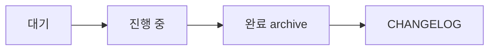

# Git 워크플로우

> **유형**: Reference · **독자**: Level 2 · **읽는 시간**: ~6분

이 문서는 `template-spring` 의 Git 사용 규약을 정리해요. 브랜치 구조, 커밋 메시지 포맷, 그 포맷을 강제하는 훅과 CI, 릴리스 절차, 그리고 backlog·문서 검증 운영 규칙까지를 한곳에서 다룹니다. 규칙의 *근거* 가 궁금하면 본문에 링크한 ADR 로 넘어가세요.

---

## 브랜치 구조

템플릿 레포는 세 종류의 브랜치를 씁니다.

| 브랜치 | 역할 |
|---|---|
| `main` | 항상 릴리스 가능 상태. 운영 배포의 기준이고, 태그를 붙이는 지점이에요 |
| `develop` | dev-server 배포 기준. `factory install` 이 `main` HEAD 에서 분기해 둡니다 |
| `feature/<topic>` | 모든 일상 작업. PR 로만 `main` 또는 `develop` 에 통합돼요 |

`main` push 는 운영 배포(`deploy.yml`)를, `develop` push 는 dev-server 배포(`deploy-dev.yml`)를 자동으로 트리거합니다. `feature/` 브랜치 직접 push 는 CI 를 트리거하지 않아요. 검증은 PR 단계에서 돌리고, GitHub Actions 분 소비를 아끼려는 의도예요.

릴리스 전용으로는 `release/v<x.y.z>` 브랜치를 따로 끊습니다. 자세한 흐름은 아래 [릴리스 프로세스](#릴리스-프로세스) 에 있어요.

파생 레포는 자기 사정에 맞게 GitFlow 등을 채택해도 됩니다. 템플릿이 브랜치 전략을 강제하지 않아요.

---

## Merge 전략 — rebase 병합만

병합은 rebase 방식 하나만 켜 둡니다. squash 와 merge commit 은 GitHub Settings 에서 끕니다. 두 가지 이유예요.

- 개별 커밋이 그대로 보존돼서 cherry-pick 재료가 됩니다. 템플릿 개선을 파생 레포로 전파할 때 커밋 단위로 골라 옮길 수 있어요.
- 선형 히스토리가 유지돼서 `git log` 와 `git diff` 의 가독성이 좋아져요.

GitHub 저장소 설정은 다음과 같이 맞춰요.

**Settings → General → Pull Requests**

- ☑ Allow rebase merging
- ☐ Allow squash merging
- ☐ Allow merge commits
- ☑ Automatically delete head branches

**Settings → Branches → `main` 보호 규칙**

- ☑ Require pull request before merging
- ☑ Require status checks — `commit-lint`, `pr-title`, `changelog-check`, `CI`
- ☑ Require branches to be up to date
- ☑ Require linear history

> 필수 status check 이름은 워크플로우의 `name:` 값과 정확히 일치해야 해요. 커밋 검증은 `commit-lint`, PR 타이틀 검증은 `pr-title`, CHANGELOG 검증은 `changelog-check`, 빌드·단위 테스트·ArchUnit 22 규칙은 단일 `CI` 워크플로우가 담당합니다.

---

## Conventional Commits 규약

### 포맷

커밋 메시지는 Conventional Commits 형식을 따릅니다.

```
<type>(<scope>): <subject>

<body — 선택>

<footer — 선택. BREAKING CHANGE / Refs>
```

### Type — 10종

`commitlint.config.mjs` 의 `type-enum` 이 아래 10종만 허용합니다. 집합 밖 타입은 커밋이 거부돼요.

| type | 의미 | 버전 영향 |
|---|---|---|
| `feat` | 새 기능 | minor |
| `fix` | 버그 수정 | patch |
| `docs` | 문서만 | patch |
| `style` | 포맷팅 | patch |
| `refactor` | 행위 변화 없는 재구성 | patch |
| `perf` | 성능 개선 | patch |
| `test` | 테스트 추가·수정 | patch |
| `chore` | 빌드·의존 업데이트 | patch |
| `build` | 빌드 시스템 | patch |
| `ci` | CI 설정 | patch |

### Scope — 선택

scope 는 변경이 어느 영역에 속하는지를 표시해요. `scope-enum` 이 다음 집합을 권장합니다.

`auth`, `user`, `device`, `push`, `billing`, `sms`, `phone-auth`, `content`, `analytics`, `attachment`, `storage`, `common`, `bootstrap`, `admin`, `spec`, `docs`, `core`, `apps`, `tools`, `ops`, `infra`, `env`, `deploy`

scope 규칙은 warning 수준이에요. scope 가 없어도, 집합 밖 scope 를 써도 커밋은 통과하고 경고만 남습니다. 막는 게 아니라 권장하는 거예요.

### Subject 규칙

subject 는 동사 원형으로 시작하는 명령형으로 씁니다. *"이 행동을 하라"* 는 의미의 git rebase 메시지 스타일이에요. commitlint 가 강제하는 제약은 세 가지입니다.

- 첫 글자는 소문자나 숫자 — `subject-case` 가 upper-case 와 pascal-case 를 막아요. PR 타이틀도 `pr-title` 워크플로우의 `^[a-z0-9].+$` 패턴이 같은 규칙을 검사합니다.
- 비어 있으면 안 돼요 — `subject-empty`
- 끝에 마침표 금지 — `subject-full-stop`
- 72자 이하 — `subject-max-length`

명령형 판단은 다음과 같아요.

- 좋음: `add feature`, `fix bug`, `refactor parser`, `rename UserSummary.name`
- 나쁨: `added feature` (과거형), `adding feature` (진행형), `Added feature` (대문자 시작)

### Breaking Change

호환성을 깨는 변경은 두 방법 중 하나로 표시합니다. 둘 다 SemVer major bump 를 유발해요.

subject 의 scope 뒤에 `!` 를 붙이거나,

```
feat(user)!: rename UserSummary.name to displayName
```

footer 에 `BREAKING CHANGE:` 블록을 둡니다.

```
feat(user): rename UserSummary.name to displayName

BREAKING CHANGE: UserSummary.name renamed to displayName.
Migration: search/replace `userSummary.name()` to `userSummary.displayName()`.
```

### 예시

통과하는 메시지예요.

```
feat(auth): add isPremium field to AuthResponse
fix(user): correct null handling in UserSummary
docs(spec): Item 3 버저닝 설계 추가
feat(user)!: rename UserSummary.name to displayName
```

거부되는 메시지와 그 이유예요.

| 메시지 | 거부 이유 |
|---|---|
| `auth 고침` | type 이 없어요 |
| `Fix: bug` | type 이 대문자예요 |
| `feat: Added feature` | subject 가 대문자로 시작 (명령형 아님) |
| `feat(auth):add field` | 콜론 뒤 공백이 없어요 |

---

## 강제 메커니즘

커밋 포맷은 세 겹으로 막아요. 로컬에서 한 번, CI 에서 두 번 검증합니다. 어느 한 겹을 우회해도 다음 겹이 잡아요.

### 1차 — 로컬 commit-msg 훅

`.husky/commit-msg` 가 커밋 순간에 두 가지를 검사합니다. `Co-Authored-By: Claude` 트레일러가 있으면 즉시 거부하고, 이어서 `npx commitlint --edit` 으로 `commitlint.config.mjs` 의 전체 룰을 돌려요. 실패하면 커밋 자체가 만들어지지 않습니다.

최초 1회만 셋업하면 돼요.

```bash
./tools/init-local.sh     # 내부적으로 npm install 실행 → husky 자동 활성화
git config --local commit.template .gitmessage
```

`package.json` 의 `prepare` 스크립트가 `npm install` 시점에 husky 를 활성화하고 `core.hooksPath` 를 `.husky` 로 잡아 줍니다. `<repo> init` 이 `npm install` 을 자동 수행하므로 대부분 별도 작업이 필요 없어요. Node 18+ 가 없으면 이 단계가 실패하니 먼저 설치하세요.

### 2차 — CI commitlint

`.github/workflows/commit-lint.yml` 이 PR 의 모든 커밋 메시지를 `commitlint.config.mjs` 로 검사합니다. 로컬에서 `--no-verify` 로 훅을 우회한 커밋도 여기서 잡혀요.

### 3차 — PR 타이틀 검증

`.github/workflows/pr-title.yml` 이 PR 타이틀의 type 과 subject 패턴을 검사합니다. rebase 병합 시 PR 타이틀이 커밋 메시지의 기준이 되므로, 타이틀도 같은 규약을 따라야 해요.

### Co-Authored-By: Claude 금지

AI 공동저자 트레일러는 어디서도 들어가면 안 돼요. 두 겹으로 막습니다. `.husky/commit-msg` 가 로컬 커밋을 거부하고, `commitlint.config.mjs` 의 커스텀 룰 `no-ai-coauthor` 가 CI 에서 같은 패턴을 다시 걸러요. 이중 안전망이에요.

### 보조 도구

강제는 아니지만 포맷을 맞추기 쉽게 해 주는 도구들이에요.

- `.gitmessage` — 메시지 없이 `git commit` 을 실행하면 에디터에 이 템플릿이 로드돼요. type·scope 목록과 예시가 주석으로 들어 있어요.
- Commitizen — `npx cz` 로 type·scope·subject 를 대화형으로 입력해 커밋을 만들어요.
- IDE 확장 — IntelliJ "Conventional Commit", VS Code "Conventional Commits".

---

## 커밋 위생 (Cherry-pick 가능성)

한 커밋은 한 논리적 변경만 담아요. 이 원칙이 깨지면 템플릿 개선을 파생 레포로 cherry-pick 할 때 커밋을 분리할 수 없어 사고가 납니다.

- 공통 코드 수정과 도메인 코드 수정을 같은 커밋에 섞지 않아요 ([`ADR-002 · GitHub Template Repository 패턴`](../philosophy/adr-002-use-this-template.md), [`ADR-015 · Conventional Commits + SemVer`](../philosophy/adr-015-conventional-commits-semver.md))
- 파생 레포에서 우연히 공통 코드를 고쳤다면 별도 커밋으로 분리해요
- 템플릿 레포는 `apps/` 가 비어 있어서 혼합 위험이 없어요

---

## 릴리스 프로세스

자세한 절차는 [`버전 규약 & Deprecation`](../api-and-functional/api/versioning.md) 에 있어요. 여기서는 두 흐름만 요약해요.

### 평상시

```bash
git checkout -b feat/topic
# ... 작업 + conventional commits ...
# CHANGELOG [Unreleased] 업데이트
git push
# PR → CI green → rebase 병합
```

### 릴리스

```bash
git checkout -b release/v0.3.0
# CHANGELOG [Unreleased] → [0.3.0] - YYYY-MM-DD 이동 + 새 빈 [Unreleased]
git commit -m "chore: release v0.3.0"
git push
# PR "chore: release v0.3.0" → CI green → rebase 병합

git checkout main && git pull
git tag -a template-v0.3.0 -m "Release v0.3.0"
git push origin template-v0.3.0
# GitHub Actions 가 Release 를 자동 생성
```

태그는 `template-v<x.y.z>` 형태로 템플릿 레포 전체를 한 단위로 버전 매겨요. 파생 레포는 "v0.3.0 기반" 이라고 단일 버전으로 추적합니다.

---

## Backlog 운영 규칙

[`docs/planned/backlog.md`](../planned/backlog.md) 는 "지금 안 하지만 잊지 말 것" 을 추적해요. 기술부채, 미완 기능, 운영 배포 대기 항목 등이 들어가요. 파생 레포가 생긴 뒤에도 이 목록이 있어야 항목이 잊히지 않습니다.

### 항목 추가

기술부채나 미완 항목을 발견하는 즉시 backlog 에 한 줄로 적어요.

```
- [ ] [카테고리] 제목 — 이유 (생성일: YYYY-MM-DD)
```

카테고리는 `Ops`, `Data`, `Obs`, `Security`, `Feature`, `DX`, `Template` 중에서 골라요.

### 항목 처리 흐름



- 대기 → 진행 중 — 항목을 "진행 중" 섹션으로 옮기고 담당 Item 번호를 붙여요
- 진행 중 → 완료 — "완료 (archive)" 로 옮기고 커밋 해시를 연결해요

  ```
  - [x] [Ops] ... — 이유 (완료일: YYYY-MM-DD, commit: abcdef0)
  ```

- archive → CHANGELOG — 2개월마다 오래된 archive 항목을 CHANGELOG 의 해당 버전 섹션으로 이관해요. backlog 는 가볍게 유지합니다.

### 새 Item plan 작성 시 체크리스트

Item 을 시작하기 전에 반드시 backlog 를 점검해요.

1. 대기 목록을 훑어 이 Item 과 관련된 항목을 식별해요
2. 관련 항목을 plan 의 scope 선언에 포함해요
3. plan 에 "이 항목들이 본 Item 에서 해소됨" 을 명시해요
4. Item 완료 시 관련 backlog 항목을 일괄 archive 하고 커밋 해시를 연결해요

이 흐름이 없으면 backlog 가 오래된 채 방치되고 항목이 영영 잊혀요.

---

## 문서 자동 검증 (docs-check)

`tools/docs-check/docs-contract-test.sh` 가 CI 에서 문서와 코드의 어긋남을 자동 검증합니다. 네 가지를 검사해요.

| 체크 | 확인 사항 |
|---|---|
| C1 | Item 7 에서 rename 된 심볼(`UserCredentials`, `TokenPair`, `PushResult`, `verifyReceipt`, `toCredentials`)이 문서에 남아 있지 않음 — CHANGELOG 와 plans 는 예외 |
| C2 | `./` 또는 `../` 로 시작하는 상대 경로 링크의 대상 파일이 실제로 존재함 |
| C3 | 문서에 언급된 환경변수(`APP_*`, `SPRING_*`, `JWT_*` 등)가 `.env.example` 또는 `application-*.yml` 에 정의됨 |
| C4 | `config/deploy.yml` 의 `env.secret`, `.kamal/secrets.example`, GHA workflow `env:` 의 secret 체인 3중 동기화 |

### 로컬 실행

```bash
./tools/docs-check/docs-contract-test.sh
```

### 오탐 처리

오탐이 나면 `tools/docs-check/exclusions.conf` 에 `<check-id>:<pattern>` 형식으로 한 줄 추가하고, 왜 예외인지 이유를 주석으로 남겨요.

### 트리거

`.github/workflows/docs-check.yml` 이 PR 과 모든 브랜치 push 에서 실행합니다. `tools/ci-test.sh` 의 5단계 검증 중 3단계가 위 검사를 호출해요. 다만 ci-test 는 문서 *내용* 만 검증하고, 워크플로우 YAML 자체의 정적 검증(actionlint)은 backlog 의 보강 항목이에요.

---

## 관련 문서

- [`버전 규약 & Deprecation`](../api-and-functional/api/versioning.md) — 버전 규약, 릴리스 절차, Deprecation 프로세스
- [`크로스 레포 Cherry-pick 가이드`](../start/cross-repo-cherry-pick.md) — 템플릿과 파생 레포 사이의 동기화
- [`Secret chain 4-stage 통합 가이드`](../production/setup/secret-chain-4stage.md) — C4 체크의 네 곳 매핑
- [`ADR-002 · GitHub Template Repository 패턴`](../philosophy/adr-002-use-this-template.md) — 템플릿 전파의 근거
- [`ADR-015 · Conventional Commits + SemVer`](../philosophy/adr-015-conventional-commits-semver.md) — 커밋 포맷을 강제하는 이유
- [`Backlog`](../planned/backlog.md) — 실제 개발 대기 목록
